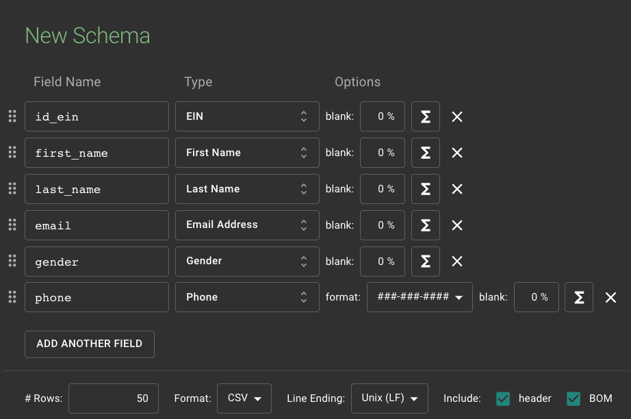
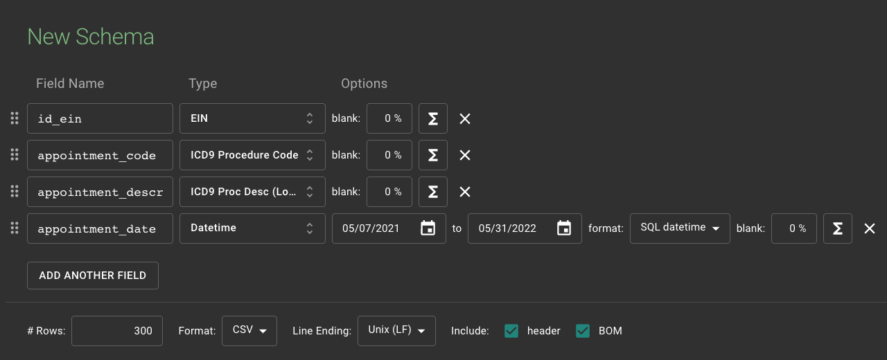

# Tiny ELT: Mock Data From Mockaroo

<div id="package">

[](https://www.python.org/dev/peps/pep-0537/#schedule-first-bugfix-release)
[](https://pypi.org/project/pandas/1.2.4)

</div>


<style>
.heatMap {
    width: 100%;
    text-align: center;
    overflow-x: scroll;
    display: block;
    margin-left: auto;
    margin-right: auto;

}
.heatMap th {
    background: #4c4c4c;
    word-wrap: break-word;
    text-align: center;
    color: white;
}
.heatMap tr:nth-child(1) { background: white; }

</style>


## Table of Contents
* [About Moock Data](#AboutMoockData)
* [Tiny ELT](#TinyETL)
* [Json Schema](#JsonSchema)
* [License](#License)
* [Author](#Author)


<a name="AboutMoockData"></a>

## About Moock Data

CSV files on `input` (appointment and users) folder were created with [mockaroo](https://www.mockaroo.com/)


<div class="heatMap">

|Users Schema|
|:-:|
||

</div>


<div class="heatMap">

|Appointment Schema|
|:-:|
||

</div>


<a name="TinyETL"></a>

## Tiny ELT
Cardinality in key `id_ein` between **table_users** and **table_appointment** is one-to-many so is necesary convert column `id_ein` in **table_appointment** to equals registries to the items `id_ein` of **table_users**.

Also was necesary to remove character `-` from items `id_ein` of **table_users**.


> Note:<br> 
> **table_users** is `MOCK_DATA_USERS.csv`<br> 
> **table_appointment** is `MOCK_DATA_APPOINTMENT.csv`<br> 


<a name="JsonSchema"></a>

## Json Schema
When you run ETL with:

```bash
python3 main.py
```

In the folder `output/schemas` you going to see next json files:

```json
// mock_data_appointment.json
{
    "id_ein": "STRING",
    "appointment_code": "STRING",
    "appointment_description": "STRING",
    "appointment_date": "DATETIME"
}
```

```json
// mock_data_users.json
{
    "id_ein": "STRING",
    "first_name": "STRING",
    "last_name": "STRING",
    "email": "STRING",
    "gender": "STRING",
    "phone": "STRING"
}
```

They're schemas for the CSV files in the folder `output`


<a name="License"></a>

## License

* [MIT License](LICENSE)


<a name="Author"></a>

## Author

* Created by [HubertRonald](https://github.com/HubertRonald)
